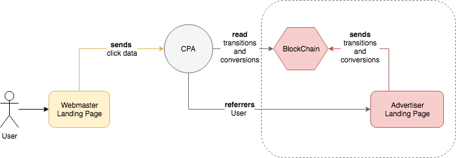
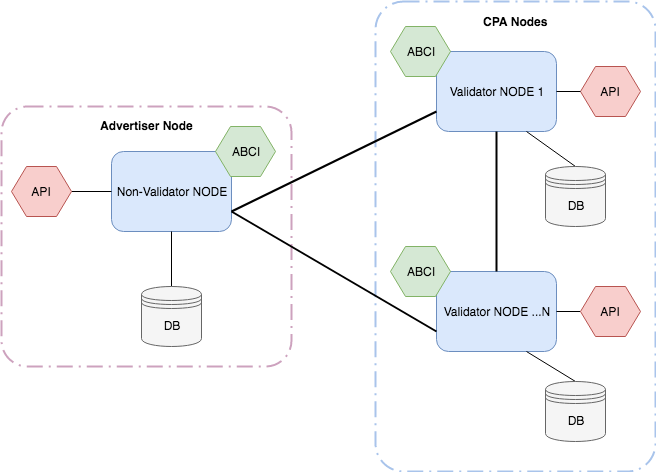

# AnychainDB
[](https://goreportcard.com/report/github.com/leadschain/anychaindb) [](https://opensource.org/licenses/Apache-2.0) [](http://makeapullrequest.com)

| Branch  | Tests |
| ------------- | ------------- |
| master  | [](https://travis-ci.org/anychaindb/anychaindb)  |
| develop  | [](https://travis-ci.org/anychaindb/anychaindb)  |

AnychainDB - secure, fast and open blockchain platform for providing transparancy in interaction between advertisers and webmasters.
AnychainDB uses the modern technologies not only from blockchain world. 
Let's take a look at them:
  * [MongoDB] - the high-performable database with full-text search
  * [Tendermint] - the heart of blockchain platform
  * [Docker] - all components of platform wrapps in containers for fast deploy and ease to use
  * [MsgPack] - transport between messages in platform
  * [Golang] - fast and beautiful language

## Introduction to idea
### Problem
At the current time, in the affiliate networks market (CPA) webmasters are faced with such an unpleasant event as a “shave”. Shave-fraudulent operations of the advertiser, aimed at reducing payments to webmasters from the above clients. In other words, when a webmaster has led one number of users to the advertiser, some users may be intentionally “lost” or “not processed” by the advertiser.

### Proposed solution
In this system, each user's transition to the advertiser's page will be sent in a distributed database (blockchain), which will be publicly available to all users of the network. Each advertiser can connect to this system for free and use it as a guarantor of honesty and transparency. 
That gives us some features as:
1. Transparency of actions provides public access to header data on transactions by any users of the network, but keeps the anonymity of the advertiser's offer and the identity of the webmaster
2. The reliability of the information is supported by the use of the Consensus algorithm, with which all participants of the blockchain network have the right to make decisions about the veracity or falsity of the incoming information automatically, based on the programmed algorithm
3. This solution posted in opensource and each participant will be able to verify its operation and use in their developments and systems
4. Actions of the advertiser and its employees (affecting to conversions and payments) become more transparent
5. The advertiser is better informed about the unfair actions of its employees

## Architecture
Below picture represents the general concept of interaction between participants of the system.



Let's breakdown Blockchain component:



The advertiser creates an account in our distributed storage and expands the blockchain, or it can deploy the full node on its local machine and integrate with Afifliate Network (CPA).
Now each user's transition to the advertiser's page from the webmaster will be sent to the blockchain. The fact of clicking will be confirmed by all network participants using consensus algorithm.
If the conversion status is changed and the payment is made, the data will also be sent to the blockchain
Now any user of the network will be able to see transactions in real time. To ensure anonymity, additional information about the transaction (name of the offer, advertiser and affiliate) will be available through the interface of the chosen CPA-network from the affiliate account.

## Installation
Officially we provide the easiest way of installation using docker and docker-compose tools.
#### Prerequirements
Installed `docker ver. 17+` and `docker-compose` tools. Good manual are [this](https://docs.docker.com/install/linux/docker-ce/ubuntu/#install-docker-ce-1 "this") and [this](https://docs.docker.com/compose/install/#install-compose "this")

#### Choose your type of node
AnychainDB has two type of nodes:
- **Validator** node can validate transactions, configured once and need have better hardware than non-validator nodes. If you are a Afiliate Network, choose this type.
- **Non-validator** node keeps the state and sends the transactions to validator nodes. The can be ease connected to the network because this type is not validates transaction. If you are a Advertiser, choose this type.

#### Configure network
If you want to connect to existing network, then all you need is *genesis.json* and *config.toml* files from the ran network. Place in to config folder and process to the next section.

Configure a new network is little more sophisticated. About this we will discuss later... (todo)
#### Deploy network
Deploy a network with the shell script:

```shell
sh deploy.sh --type=${JOB_TYPE} --node_ip=${NODE_IP} --config=${CONFIG_PATH}
```
Parameters:
* **type** - type of job for script. You can choose from *node*, *node-dev*, *update*, *update-dev*, *clean* types
* **node_ip** - ip address of node. Default script uses `dig` with `OpenDNS` as resolver. *Example: 127.0.0.1*
* **config** - full path to config folder. *Example: /home/ubuntu/CONFIG_FOLDER*
* db_port - port for communication with MongoDB container. *Default: 27017*
* p2p_port - port for communication between nodes. *Default: 46656*
* grpc_port - port for RPC client. *Default: 46657*
* abci_port - port for ABCI application. *Default: 46658*
* api_port - port for AnychainDB REST API. *Default: 8889*
* node_args - additional arguments for node. If you connect to existing network, you maybe need to set boot nodes addresses, like: `--node_args="--p2p.persistent_peers=id@host:port"`

By default script creates *AnychainDB* directory in home folder of user, where keeps all data from state. Do not remove it.
You may change it by setting another value in ${DATA_ROOT} script variable.

## Additional docs
  * [AnychainDB REST API] - REST API for AnychainDB client
  * [Tendermint Docs] - Tendermint documentation

License
----
Apache 2.0

   [MongoDB]: <https://www.mongodb.com/>
   [Tendermint]: <https://github.com/tendermint/tendermint>
   [Docker]: <https://www.docker.com/>
   [MsgPack]: <https://msgpack.org/>
   [Golang]: <https://golang.org/>
   [AnychainDB REST API]: <https://leadschain1.docs.apiary.io/>
   [Tendermint Docs]: <http://tendermint.readthedocs.io/en/master/introduction.html>